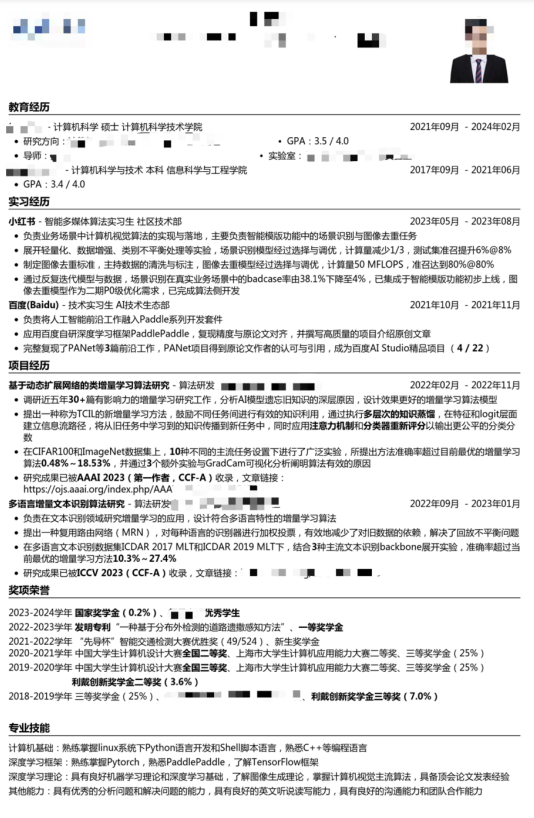

# AI算法

本篇内容整理自黄丙晨学长的经验分享：[牛客网](https://www.nowcoder.com/discuss/603420182228320256)

黄丙晨学长是2024届复旦计算机硕士毕业生，转载已获作者授权。

## 前言

从暑期实习屡战屡败，几乎被所有大中厂拒之门外，到秋招拿下若干大中厂不错的offer，仅不到半年。我也从面试时低声下气的萌新，成长为和面试官吹牛脸不红心不跳的老油条。这其中变化的原因，一部分来自于项目经历有所丰富，但更重要的则是面试经验的增加。作为万千毕业生中非常普通的一个，我没法像大佬那样纯靠自身实力轻松卷赢，因此只能在包装自己上狠下功夫。

关于如何准备机试和项目，前面的学长学姐介绍的已经很多了。因此本篇的核心就在于，如何最大化利用自己手上的牌，更好地包装自己，拿到更好的offer。

本篇主要分为前言、简历、技术面、主管面、HR面、后记六大模块。当然，有些经验可能并不通用，需要大家针对自身情况进行调整，也请大家多多担待。

## 简历

简历优化核心：扬长避短，高度契合

简历大致可分为四个部分，教育经历是门槛，项目经历是核心，专业技能是必要条件，奖项荣誉是锦上添花（可选项，没有也无所谓）。重要程度代表着该项对于简历提升的影响大小。这个排序也是建议的简历排版顺序。

### **教育经历（重要程度：🌟🌟）**

1. 最高学历排在前面，学校不错的话可以加个logo（绝对不能造假！）

2. GPA排名好看写排名，绩点好看写绩点，都不好看就不写

3. 导师/实验室牛逼，只管往上写

4. 如果啥都没有显得太空，把相关课程写上，成绩好可以附带课程成绩

教育背景中，学历学位是最重要的，这部分不能造假，而GPA、课程说实话影响很小，因此整体可操作空间不大。

### 项目/实习/科研经历（重要程度：🌟🌟🌟🌟🌟）

1. 适当美化在项目中扮演的角色/工作量/成果

2. 突出自己用技术做了什么工作，而不是简单罗列技术

3. 量化项目成果，尽量使用数字（若有），可以加粗显示。如：“**获得字节跳动青训营二等奖**”

4. 控制详略程度，分点阐述。不要一两行就写完，也不要列十几点

5. 只保留与应聘方向契合的项目，以二至四个为宜，突出重点项目

6. 该部分在整个简历中的篇幅占比约在50%，项目经历是HR、面试官关心的核心部分，可操作空间最大，因此是拉开简历差距的地方。

简历无项目，秒进人才库。关于无项目无实习该怎么办，前人已经提供了几种方法，主要为：Github等开源网站的项目、别人愿意分享的项目（质量最高，且撞车概率低）、网上及线下培训的项目。在此补充一些具体的可速成的项目，开发可以关注公司的线上培训，如字节青训营，算法可以关注近期kaggle比赛/各大会议的workshop比赛。

接下来就是对项目的包装。工作量大小、项目中具体担任的角色，乃至该项目的成果和意义，都有极大的发挥空间。只要对于细节了如指掌，哪怕某部分不是你的工作，也成为了你的工作；反之，即使代码是你一行行敲出来的，如果没做好准备回答不出来，真实性也会被质疑。

对于开发同学来说，很多开源项目（比如瑞吉外卖）已经烂大街，包括字节青训营的项目，面试官也老早听的耳朵起了老茧。尽量找些冷门的开源项目，或至少在原项目上加以改进（体现自己工作的差异性和思考）。对于算法同学来说，由于项目中本身就包含了大量指标，一定要尽可能多地使用数字量化自己的成果，哪怕只是一个简单的数字，一加粗后也能让人不明觉厉。

项目经历部分以2～4个项目为宜，如果项目经历很多，就只保留最相关的项目，不要想着把各个方向的项目往上扔，面试官就会觉得你是个不可多得的全才。之前看到过一位同学，把测试、后端的项目放一个简历里，测试的面试官会怀疑他是否真的会来做测试，后端的面试官会觉得他技术栈太杂，连后端都没学精就去搞测试了，两边不讨好，遇到这种情况就应当一个岗位做一份简历。至于简历是否要在一页内，仁者见仁智者见智，我还是倾向于不要超过一页。校招生通常没有那么多有价值的经历可写，大部分情况是因为不懂得精简而超出了一页。超级简历就有智能一页的功能，很方便。（我一直用超级简历，没必要追求一定用latex做）

### **专业技能/个人评价（重要程度：🌟🌟）

1.对照JD来写

2.专业技能和个人评价二选一写即可，分点阐述，三至五行就够了，不要浪费大量篇幅来写

专业技能/个人评价是简历的必要部分，但也是提升空间最小的部分，只是HR用来筛选掉专业不对口的候选人的。如何让自己的简历显得专业对口？最稳妥的方式，就是照着岗位的JD抄。（与期望招聘对象重合度100\
奖项荣誉（可选）

奖项荣誉较少或简历空间不足，合并到教育经历中；奖项荣誉较多或仍有简历空间，则单独列出，但不要占据太多篇幅，优先保留最相关的奖项。至于学生工作与技术岗毫无关系，没必要写。

最后附上一张我的秋招简历，以供参考～

## 技术面

关于技术面，前人之述备矣，就不重复造轮子了，在此只是简单提一下。技术面的核心在于：掌握主动权，将面试引向自己熟悉可控的领域，同时偷偷给自己贴正面标签。

基本所有的面试，都有自我介绍的环节。在自我环节时，若只是简单重复简历上的内容，就浪费了自我宣传的最佳时机。像自我评价/他人评价，以及一些不太相关的经历、项目，是不方便写在简历里的，此时正好拿出来讲，例如：

对你感兴趣的面试官，不会因为你自我介绍时多说了几句不太相关的经历就对你印象不好。如果面试官没耐心打断你自我介绍，大概率本就是KPI。如此在自我介绍中包装自己，不仅在前期就能留下一个不错的印象，而且有概率引发面试官的追问，既能水时长，还能继续包装自己。比如我曾经遇到的，“你C++做过什么项目？”“能介绍下是怎么从零开始探索新的方向的吗？当中遇到了哪些困难？”虽然追问的概率不大，但还是要注意对于可能的追问要有个底，别光顾着往脸上贴金，忽略了细节准备。

我将面试问题分为三类：**八股题，细节题，技术题。**

这三类中，技术题是最难的，因为技术题的边界太广了，无法保证自己可以掌握每一个知识点。由于专业领域限制，除非瞎猫碰到死耗子，否则大多时候我都答不出来非自己领域的专业技术题。因此，剩下八股题和细节题是我们重点要争取的，八股题可以提前背诵，而细节题是考察做过的项目细节，通过多多温习就能掌握，甚至不需要背诵，是我最喜欢的题型。

因此如何掌控整场面试的走向，就变成了如何引导面试官多问细节题和八股题，而不要让面试官把话题转向自己提前准备且熟悉的技术题。关键在于回答时故意留坑，在回答上一个问题时，就有意识地往下一个八股/细节去引，等待面试官去问。比如：

Q：你的这个项目做了哪些改进，获得了这样的提升？

A：由于模型需要上线，对于计算量和模型大小的要求较高。前期我做了一些轻量化的剪枝实验，进行了backbone的选择，参数下降xx，计算量下降xx，最终选择了xx作为backbone。在训练过程中，发现模型因为类别不平衡存在明显性能问题，从数据、模型等角度进行了优化，最终实现了xx的性能提升。不过我也发现，学术界和工业界还是明显不同的，我复现了a、b、c的策略（偷偷贴金，体现自己代码能力和读的论文多），最后都不如多做几遍数据清洗，补充少样本类别效果来得好。

接下来，面试官可能追问以下问题：

如果真遇到回答不出来的技术题，不要硬着头皮回答，大大方方地承认这块了解不够，同时再像上面那样，抛给面试官一些可以询问的点：“这个领域我之前了解不多。不过对于xxx，我也有些项目经验”。大方承认自己的知识漏洞不是减分项，回答错误或者支支吾吾答不出来才是。

## 主管面

主管面虽然也属于技术面的一环，但在我看来，主管面的面试逻辑和前几轮的技术面是差异很大的，而且很大程度影响你的offer评级，因此单独列一节。

和前面的技术面不同，大多数主管并不会关注技术细节，往往是站在更高层次的角度思考问题。他们更关注的是人与宏观的技术。（毕竟主管们可能早就不在一线写代码了）核心在于让主管了解你，并且聊的开心。

自我介绍时，可以适当减少技术细节的叙述，增加对个人的包装。整体思路和技术面是类似的，回答时故意留坑，只不过留坑的目的有所变化，从引导面试官问技术细节和八股，变为让主管更好地了解自己是什么样的人，以及对技术的宏观层面的思考。比如这样自我介绍：

## HR面

到达HR面，只要不作死（比如，“如果a公司给我发offer的话，我就不来贵公司了”，我曾经犯过这样的错），别太老实，该舔的时候舔，就能顺利拿到offer（池子里还有其他人的情况除外）。如果是实习，到这一步就完美结束了，或是等待后续的排序结果。如果是正式招聘，则还有一个重要的环节——谈薪。

谈薪前，有一个问题几乎是必问的：“您现在手上有哪些offer？”

无论有没有offer，一定要回答有，至少说offer正在审批阶段。如果说没有offer，就是自愿将议价权交给对方，成为任人宰割的羔羊，给多少价对方全凭良心。且很多公司一开始都会压价，就靠别家offer来argue最终薪资。

谈薪主要有两种形式：1. OC后直接给出薪酬方案；2. 先询问预期薪酬，后定薪酬方案。

第一种形式谈薪比较简单，直接给出薪酬方案能谈的涨幅不大，基本在当前评级内浮动。比如白菜价的范围是20～23k，offer给了20k，通过谈薪有机会要到23k、24k，但不太可能超过当前评级薪酬太多。

第二种形式谈薪较为复杂。如果预期薪酬报低了，HR真不会跟你客气，稍微多给你一点意思一下；如果预期薪酬过高，HR发现没法满足，甚至会连通知都没有就把offer取消了。

在这分为两种情况：offershow/牛客上有薪资爆料和无薪资爆料的公司。有薪资爆料的很简单，了解投递岗位白菜/sp/ssp的薪资水平后，结合自己的面试感受和表现，估计自己是什么水平，可以适当多要一两千。一些初创公司往往没有薪资爆料，这时候就需要对行业薪酬有个大致的预期，然后采用分段试探谈薪法：

“目前手上已有一个a公司的offer，20k。综合考虑贵公司的工作内容和发展前景，还是想选择贵公司，期望不低于这个价。”

在第一轮时，可以用相对一般的预期薪酬进行试探。如果面试公司比a公司规模小，报价也在承受范围内的话，一定会给出稍高一些的价格。如果感觉HR答应的很爽快，还有谈薪空间，过几天可以尝试进一步试探：

“昨天b公司也发了offer，24k。我真的很想加入贵公司，您这边能否再帮我争取一下？”

如此便能降低谈薪太少吃亏、谈薪太多offer取消的概率。

## 后记

时光飞逝，转眼间距离我发出关于2024暑期实习迷茫求助贴的那一天，已经过去了一年。早期我面试经验非常有限，几乎所有的大中厂都将我拒之门外。当时的我非常迷茫，甚至一度考虑转换求职方向。于是，我决定在牛客上分享自己的经历，向大家征询意见。让我意外的是，这一分享引来了很多热心朋友的帮助和鼓励。无论是私信还是评论，大家都给了我莫大的支持，还推荐了不少实习机会，让我感动不已。如今，我整理出了这篇求职攻略，希望能将这份善意继续传递下去，尽我所能帮助更多的后来者。

如今，计算机行业的黄金时代已成过去，就业市场供过于求。要想获得一份理想的工作，除了自身实力过硬，还需要寻找一些新的突破点。因此，在这篇攻略中，我分享了一些独特的技巧和方法。当然，打铁还需自身硬，掌握技巧的前提是拥有足够的能力，包装自己的前提是有内容可包装。所以，希望大家不要本末倒置，过度追求包装而忽略了基础实力的提升。

最后，再次感谢所有帮助和鼓励过我的朋友们！在经历了心态崩溃之后，我很快调整了状态，继续投递简历，寻找机会。去年五月底，我终于拿到了第一家，也是唯一一家中型企业的实习机会。相比于暑期的坎坷经历，由于积累了更多的经验，秋招显得顺利了许多。如今，我已经入职美团，开启了人生的新篇章。江湖路远，有缘再会！以下是我的个人主页，其中有我的联系方式，欢迎有想咨询问题的学弟学妹~

**个人主页:** [github](https://yellowpancake.github.io/)
