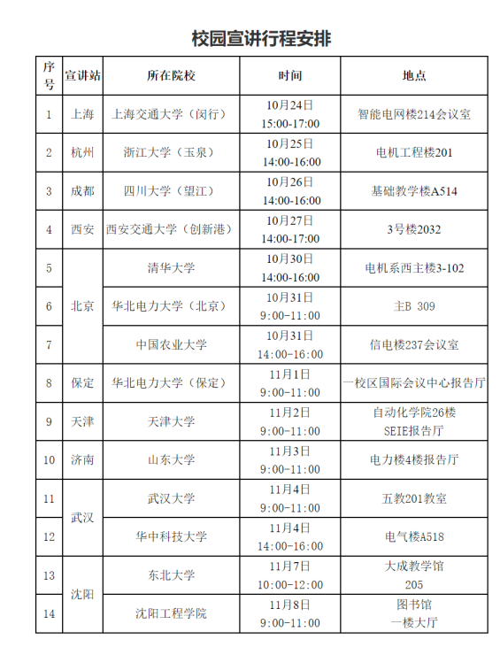

# 国家电网

国家电网的架构为总部-大区分部，总部-省公司，总部-直属机构。其中公司总部近年来只招聘电气工程专业的毕业生，而其他的分部，省公司，直属机构都会招计算机类专业毕业的同学。国家电网每年招聘每年一共有三次，提前批，一批，二批，每年的招聘、录取通知都会在[官方人力资源招聘网站](https://zhaopin.sgcc.com.cn/sgcchr/static/home.html)上公告。提前批一般会在每年的9-10月份出公告，一批会在11月左右，二批会在第二年的3月左右。提前批主要面向原985，211，原电力部属院校的电气类专业研究生，以及部分原985院校的**计算机类，通信类专业**研究生。一批和二批的流程都是笔试+面试，一批的报考要求会相对高一些，大部分会要求本科以上，二批次电工类专科也可以报考，岗位也会有相应的不同。注意，**有些省份的一批不招计算机专业的**（如重庆市），那错过了提前批，就只能去报二批。同时要注意，报考**基本上都有年龄要求**，一般是要求，专科生不超过23周岁、本科生不超过25周岁、硕士研究生不超过28周岁、博士研究生不超过33周岁。

## 提前批

提前批主要是省公司及其分支机构才会有，一般在每年的 9-10 月份会在国网招聘官网上发布（首页-省公司-单位一览-最近动态），上面除了招聘信息外，还会列出校园宣讲会的行程表，如 24 年辽宁省的行程安排如图所示。

招聘团队每年会按照这上面的行程，到不同的城市和大学去进行宣讲，一般是当场收简历，当场面试，甚至是当场发offer。对于计算机类专业和通信类专业（信息学院的同学也可去报）的同学，给的offer岗位一般是各省的信通公司，以及市局的通信部门。

**要注意，并不是只有宣讲院校的同学才能去参加面试**，所有符合条件的同学都可以去。所在城市没有行程安排，也要去别的城市参加。

省公司的提前批一般没有笔试，只有面试。面试跟之前介绍的泛体制面试一样，技术问题很少，有以下几个地方要注意。

1.如果在四六级，计算机等级考试，在校成绩，综合荣誉，和爱好特长方面有亮点的，在面试自我介绍的过程中，要加上这些内容，简历上也要写。

2.一定要表达出留在当地工作的强烈意愿。比如本地人想回老家；大学在那读的；想定居等等。

3.介绍项目/学习经历最好能往业务上贴，建议面试前，去网上了解一下目标省份信通公司最近在做的重点业务。然后这样去介绍，比如：我特别想去老家电网，平时也很关注家乡电网一直在做的工作，最近看到你们完成了xxx，那刚好我的研究方向是xxx，之前实习的时候做过xxx的相关项目，希望自己能有机会利用这方面积累的能力，为xxx的后续工作提供一份力量。

如果你在面试中失利，没有拿到心仪的offer，一个重要的建议是，继续去追宣讲行程。换位思考一下，如果你是面试官，发现有一个同学经常会在面试中出现，跟着宣讲在全国各地到处跑，是不是也会被他的诚意打动？这不一定百分百有效，但根据往届同学反馈的经验，有机会。

另外一个建议是，如果你的宣讲场次比较靠后，建议在时间方便的情况下直接去其他城市参加第一场宣讲，或者在前面几场中按照地点情况，挑一个竞争可能会小的场次。

## 一批

国网一批开启时间较晚，在秋招的尾声阶段，可以关注国网招聘的公众号，里面有详细的报名流程和简历填写指南。
在单位选择上，如果选择研究院要打听好该院的硕博比例，博士太多的话硕士可能就没有晋升机会了，还要关注一下出差的频繁度。如果是选择各地方的话，要看一下是否会被分到偏远地区（概率不小）。

**关于笔试：**

笔试一般是在周末，线下机考。包含少量行测、少量企业文化、大量计算机。

企业文化这个有固定题目，一般国网招聘公众号上都有。还记得当时有一道题问是国网铁军，还是国网雄狮，我觉得狮子比较威武就选错了，现在想起来还是很懊悔，这种企业文化题千万不能“你觉得”，是什么就是什么，背就完事了。

笔试其实很重要，占总成绩的百分之70，我当时面试表现很好，但是笔试裸考只有53分，最终没有拿到offer，所以得笔试者得天下。占大头的计算机，和考研408的风格不一样，有很多软件工程、数据库这类的东西，后来我发现相关的题库里都有，所以想去国网的一定要好好刷题，血泪教训。

**关于面试：**

笔试后的一周就是面试，各单位面试内容不一样，这里只说我报的某信通分公司。

一组10个人由老师带领候场，每次只进一个人，对面大概有5个面试官。首先面试官会翻一个八股的小册子，问一道简单八股，我被问的是错误码503代表什么出问题了。然后就会问项目经历，结合项目问更深层次的问题，我的感受是对面的面试官技术是可以的，问的问题甚至比有的大厂面试官还深还难，但探讨过程还是很友好的，这段在整个面试部分占了大部分时间。

然后应该是领导的人会问一些项目中用到的技术，这里说宏观框架就可以，说的过细会被打断。最后给你一段英文，一分钟准备，先朗读英文，再把他翻译成中文。面试就结束了，没有反问时间。
